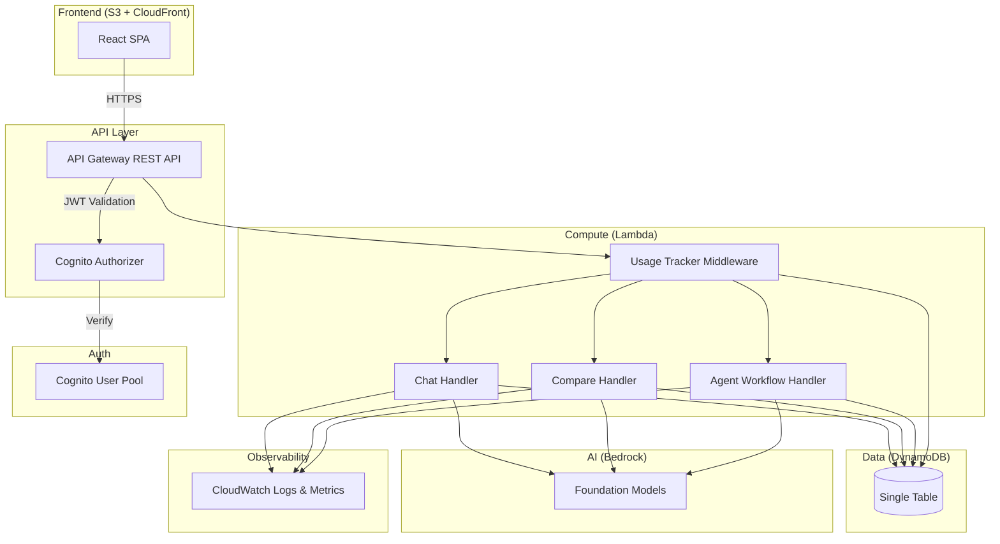

# Design Document: Bedrock AI Playground

## Overview

The Bedrock AI Playground is a serverless web application deployed on AWS that provides three distinct AI interaction modes — Chat, Multi-Model Compare, and Agent Workflow — backed by Amazon Bedrock foundation models. The system uses a fully serverless architecture (Lambda, API Gateway, DynamoDB, S3/CloudFront) to minimize costs and leverage AWS free-tier offerings. Per-user usage tracking is enforced via DynamoDB-backed token budgets and rate limiting. The frontend is a React SPA served from S3/CloudFront, communicating with a Lambda-backed REST API through API Gateway.

### Key Design Decisions

1. **TypeScript everywhere** — Both frontend (React/Vite) and backend (Lambda handlers) use TypeScript for type safety and shared interfaces.
2. **Monorepo structure** — A single repo with `packages/` for shared types, `apps/web/` for the frontend, `infra/` for Terraform, and `apps/api/` for Lambda handlers.
3. **DynamoDB single-table design** — One table with composite keys to store users, conversations, messages, usage records, and workflow traces. Minimizes provisioned tables and stays within free-tier.
4. **Streaming via Lambda response streaming** — Chat and Agent Workflow modes use Lambda response streaming through API Gateway to deliver tokens incrementally.
5. **Cognito User Pools for auth** — Leverages the free-tier (50,000 MAU) for authentication, JWT-based session management, and built-in lockout policies.
6. **Terraform for IaC** — Aligns with existing repo patterns on the `open-ai` branch.

## Architecture



### Request Flow

1. User interacts with React SPA served from CloudFront
2. SPA sends HTTPS request to API Gateway with Cognito JWT in Authorization header
3. API Gateway validates JWT via Cognito Authorizer
4. Request hits Usage Tracker middleware Lambda layer — checks rate limit and token budget
5. If within limits, request is forwarded to the appropriate handler (Chat, Compare, or Agent)
6. Handler invokes Bedrock model(s), streams response back through API Gateway
7. Handler persists conversation/workflow data to DynamoDB
8. Handler emits metrics and logs to CloudWatch

## Components and Interfaces

### 1. Session Manager (Cognito + Frontend Auth Module)

Handles user authentication using Amazon Cognito User Pools.

```typescript
// packages/shared/src/types/auth.ts
interface AuthConfig {
  userPoolId: string;
  clientId: string;
  region: string;
}

interface AuthSession {
  accessToken: string;
  idToken: string;
  refreshToken: string;
  expiresAt: number;
}

interface AuthService {
  signIn(email: string, password: string): Promise<AuthSession>;
  signOut(): Promise<void>;
  refreshSession(refreshToken: string): Promise<AuthSession>;
  getCurrentSession(): AuthSession | null;
}
```

### 2. Usage Tracker (Lambda Middleware)

Enforces per-user rate limits and token budgets. Implemented as shared middleware invoked at the start of each handler.

```typescript
// apps/api/src/middleware/usageTracker.ts
interface UsageRecord {
  userId: string;
  windowStart: number; // epoch ms, start of current 24h window
  tokenCount: number; // tokens consumed in current window
  requestTimestamps: number[]; // recent request timestamps for rate limiting
}

interface UsageLimits {
  tokenBudget: number; // default: 100_000 tokens per window
  windowDurationMs: number; // default: 86_400_000 (24h)
  maxRequestsPerMinute: number; // default: 10
}

interface UsageCheckResult {
  allowed: boolean;
  remainingTokens: number;
  retryAfterMs?: number;
  warningThreshold: boolean; // true when >= 80% consumed
}

function checkUsage(
  userId: string,
  estimatedTokens: number,
): Promise<UsageCheckResult>;
function recordUsage(userId: string, tokensConsumed: number): Promise<void>;
```

### 3. Model Router

Selects and invokes Bedrock foundation models.

```typescript
// apps/api/src/services/modelRouter.ts
interface ModelConfig {
  modelId: string; // e.g., "anthropic.claude-3-haiku-20240307-v1:0"
  displayName: string;
  maxTokens: number;
  costPerInputToken: number;
  costPerOutputToken: number;
}

interface ModelInvocation {
  modelId: string;
  prompt: string;
  conversationHistory: Message[];
  maxTokens: number;
  temperature: number;
}

interface ModelResponse {
  modelId: string;
  content: string;
  inputTokens: number;
  outputTokens: number;
  latencyMs: number;
}

function invokeModel(invocation: ModelInvocation): AsyncGenerator<string>;
function invokeModelsParallel(
  invocations: ModelInvocation[],
): Promise<ModelResponse[]>;
function listAvailableModels(): ModelConfig[];
```

### 4. Chat Handler

Processes single-model conversational interactions.

```typescript
// apps/api/src/handlers/chat.ts
interface ChatRequest {
  conversationId?: string; // omit to create new conversation
  message: string;
  modelId: string;
  temperature?: number;
}

interface ChatResponse {
  conversationId: string;
  messageId: string;
  content: string; // streamed incrementally
  tokenUsage: { input: number; output: number };
}

function handleChat(event: APIGatewayEvent): Promise<StreamingResponse>;
```

### 5. Compare Handler

Processes multi-model comparison requests.

```typescript
// apps/api/src/handlers/compare.ts
interface CompareRequest {
  prompt: string;
  modelIds: string[]; // 2+ model IDs
  temperature?: number;
}

interface CompareResponse {
  comparisonId: string;
  results: {
    modelId: string;
    displayName: string;
    content: string;
    latencyMs: number;
    tokenUsage: { input: number; output: number };
    error?: string;
  }[];
}

function handleCompare(event: APIGatewayEvent): Promise<APIGatewayResponse>;
```

### 6. Agent Workflow Handler

Processes multi-step agent workflows with visible reasoning chains.

```typescript
// apps/api/src/handlers/agentWorkflow.ts
type StepStatus = "pending" | "running" | "completed" | "failed";

interface WorkflowStep {
  stepId: string;
  description: string;
  status: StepStatus;
  input: string;
  output?: string;
  startedAt?: number;
  completedAt?: number;
  error?: string;
}

interface WorkflowRequest {
  task: string;
  modelId?: string; // defaults to Claude 3 Haiku
}

interface WorkflowResponse {
  workflowId: string;
  task: string;
  steps: WorkflowStep[];
  finalResult: string;
  totalTokenUsage: { input: number; output: number };
}

function handleAgentWorkflow(
  event: APIGatewayEvent,
): Promise<StreamingResponse>;
```

### 7. Conversation Store

Persistence layer for conversations, messages, comparisons, and workflow traces.

```typescript
// apps/api/src/services/conversationStore.ts
interface Conversation {
  conversationId: string;
  userId: string;
  title: string;
  mode: "chat" | "compare" | "agent";
  createdAt: number;
  updatedAt: number;
}

interface Message {
  messageId: string;
  conversationId: string;
  role: "user" | "assistant";
  content: string;
  modelId: string;
  tokenUsage: { input: number; output: number };
  timestamp: number;
}

function createConversation(
  userId: string,
  mode: string,
): Promise<Conversation>;
function getConversation(conversationId: string): Promise<Conversation>;
function listConversations(userId: string): Promise<Conversation[]>;
function deleteConversation(conversationId: string): Promise<void>;
function addMessage(conversationId: string, message: Message): Promise<void>;
function getMessages(conversationId: string): Promise<Message[]>;
```

## Data Models

### DynamoDB Single-Table Design

All entities share one DynamoDB table with composite primary key (`PK`, `SK`) and a GSI for reverse lookups.

| Entity        | PK                      | SK                            | GSI1-PK                 | GSI1-SK |
| ------------- | ----------------------- | ----------------------------- | ----------------------- | ------- |
| User Session  | `USER#<userId>`         | `SESSION#<sessionId>`         | —                       | —       |
| Conversation  | `USER#<userId>`         | `CONV#<conversationId>`       | `CONV#<conversationId>` | `META`  |
| Message       | `CONV#<conversationId>` | `MSG#<timestamp>#<messageId>` | —                       | —       |
| Comparison    | `CONV#<conversationId>` | `CMP#<comparisonId>`          | —                       | —       |
| Workflow      | `CONV#<conversationId>` | `WF#<workflowId>`             | —                       | —       |
| Workflow Step | `WF#<workflowId>`       | `STEP#<order>#<stepId>`       | —                       | —       |
| Usage Record  | `USER#<userId>`         | `USAGE#<windowStart>`         | —                       | —       |
| Rate Limit    | `USER#<userId>`         | `RATE#<minuteEpoch>`          | —                       | —       |

### Conversation Serialization Format

Conversations are serialized to JSON for storage and API transport:

```typescript
interface SerializedConversation {
  conversationId: string;
  userId: string;
  title: string;
  mode: "chat" | "compare" | "agent";
  createdAt: string; // ISO 8601
  updatedAt: string; // ISO 8601
  messages: SerializedMessage[];
}

interface SerializedMessage {
  messageId: string;
  role: "user" | "assistant";
  content: string;
  modelId: string;
  tokenUsage: { input: number; output: number };
  timestamp: string; // ISO 8601
}

function serializeConversation(conv: Conversation, messages: Message[]): string;
function deserializeConversation(json: string): {
  conversation: Conversation;
  messages: Message[];
};
```

### Usage Record Schema

```typescript
interface UsageWindowRecord {
  userId: string;
  windowStart: number;
  windowEnd: number;
  tokenCount: number;
  requestCount: number;
  lastRequestAt: number;
}
```

### Infrastructure Layout

```
.
├── apps/
│   ├── web/                    # React SPA (Vite + TypeScript)
│   │   ├── src/
│   │   │   ├── components/     # UI components
│   │   │   ├── hooks/          # Custom React hooks
│   │   │   ├── pages/          # Route pages (Chat, Compare, Agent)
│   │   │   ├── services/       # API client
│   │   │   └── store/          # State management
│   │   └── vite.config.ts
│   └── api/                    # Lambda handlers (TypeScript)
│       ├── src/
│       │   ├── handlers/       # chat.ts, compare.ts, agentWorkflow.ts
│       │   ├── middleware/     # usageTracker.ts, auth.ts
│       │   └── services/      # modelRouter.ts, conversationStore.ts
│       └── tsconfig.json
├── packages/
│   └── shared/                 # Shared TypeScript types
│       └── src/types/
├── infra/                      # Terraform
│   ├── main.tf
│   ├── variables.tf
│   ├── outputs.tf
│   ├── modules/
│   │   ├── api-gateway/
│   │   ├── lambda/
│   │   ├── dynamodb/
│   │   ├── cognito/
│   │   ├── s3-cloudfront/
│   │   └── iam/
│   └── environments/
│       └── prod/
└── package.json                # Monorepo root (npm workspaces)
```
